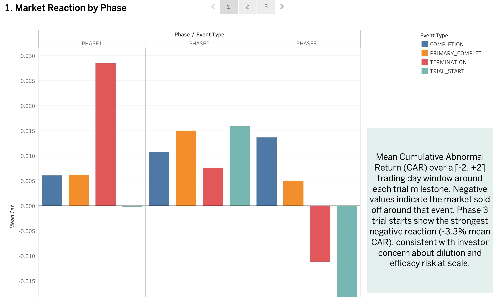
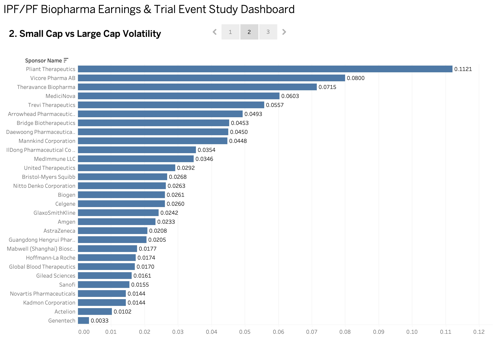
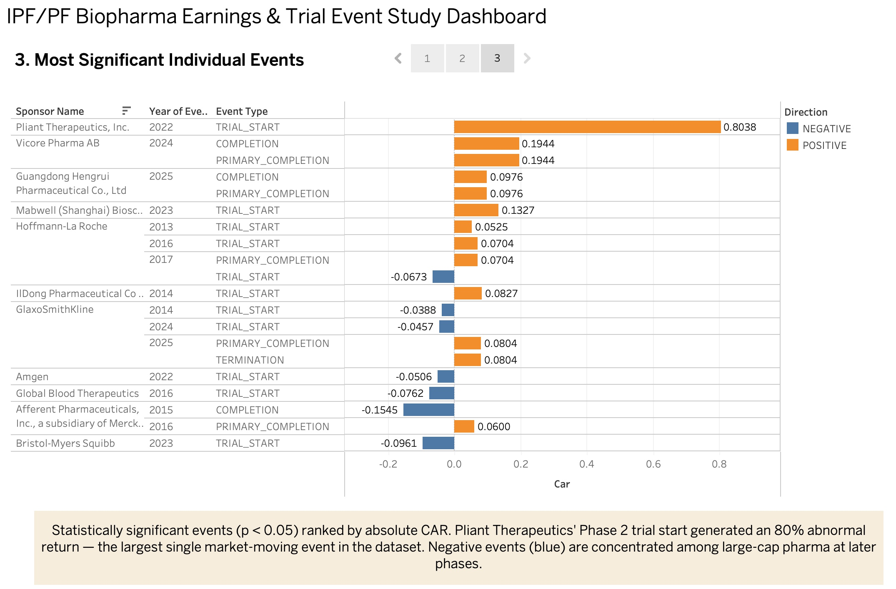

# IPF/PF Biopharma Trial Event Study

I spent time in Corporate Development and FP&A at an IPF-focused biopharma company, and one question kept coming up in the work I was doing — deal benchmarking, competitive intelligence, stakeholder reporting — does the market actually understand what's happening in IPF clinical trials? Not in a vague sense, but specifically: when a trial starts, or gets terminated, or completes, does the stock price move in a way that reflects what that milestone actually means for the company's pipeline?

This project is my attempt to answer that empirically. I used a standard financial event study methodology to measure abnormal stock returns around trial milestones for the 42 publicly-traded sponsors I identified in the companion [IPF/PF Clinical Trial Intelligence Database](https://github.com/chasepatterson221/ipf-trial-intelligence). The two projects share a single Postgres database and are designed to be read together.

**[View the live Tableau dashboard →](https://public.tableau.com/app/profile/chase.patterson8613/viz/IPF_PF_Earnings_Event_Study/Story1)**

---

## Why IPF specifically

IPF is an interesting disease area to study this question in because the history of drug development there is genuinely difficult — decades of failed trials before pirfenidone and nintedanib were approved in 2014, and a patient population small enough that trial results carry outsized weight for the companies running them. There's real scientific uncertainty baked into every IPF trial announcement, which makes how the market responds to those announcements worth examining carefully.

Having worked in this space, I also had enough domain knowledge to interpret what the data was actually telling me rather than just running the numbers and reporting them.

---

## What I built

1. Pulled historical daily stock prices (2010–present) for all 42 publicly-traded IPF/PF sponsors using `yfinance` — ended up with 113K+ price rows across 31 active tickers (a couple were delisted and unavailable)
2. Extracted trial milestone dates from Project 1's database and matched each one to the sponsoring company's ticker
3. Ran the event study — for each milestone, I computed the Cumulative Abnormal Return (CAR) over a 5-day window centered on the event date, using the 60 trading days before that window to establish a baseline expected return
4. Analyzed the results three ways: by phase, by sponsor size, and by individual event significance
5. Visualized everything in Tableau

---

## What I found

**Phase 3 trial starts are where the market gets nervous.** Phase 1 and Phase 2 starts produce small positive reactions on average, but Phase 3 flips that — mean CAR of -3.3%, the strongest negative reaction in the dataset. It makes sense once you think about it: Phase 3 trials are expensive, they often require capital raises that dilute shareholders, and IPF's track record at Phase 3 gives investors legitimate reason to be skeptical. Phase 3 terminations show the same pattern (-1.1% mean CAR), while early-phase terminations actually show slight positive reactions — a "cut your losses" relief effect that shows up pretty consistently in biotech event study research.

**Company size matters more than almost anything else.** Pliant Therapeutics (PLRX) averaged a 15% absolute abnormal return across its trial events. Roche (RHHBY) averaged 1.7%. That gap isn't surprising — for a small biotech, a single IPF trial is often the program. For large pharma, it's one line item in a broad portfolio. The single largest event in the whole dataset was Pliant's Phase 2 trial start in July 2022, which generated an 80% abnormal return in a five-day window.

**On aggregate, the signal is weaker than I expected.** Only about 5-11% of events were statistically significant at p<0.05 — close to what you'd expect by random chance. That's actually an important and honest finding: the market doesn't systematically misprice IPF trial events on average. The interesting stuff happens at the tails — specific phases, specific company sizes, specific milestones — not uniformly across the board.

---

## Dashboard preview

**Market Reaction by Phase — Phase 3 Trial Starts Trigger Selloffs**

**Sponsor Volatility — Small-Cap Biotechs React 5-10x More Than Large Pharma**

**Most Significant Individual Events — Pliant's Phase 2 Start Drove an 80% Abnormal Return**

*(Static previews above — [explore the live interactive version here](https://public.tableau.com/app/profile/chase.patterson8613/viz/IPF_PF_Earnings_Event_Study/Story1).)*

---

## Methodology

| Parameter | Value |
|---|---|
| Event window | [-2, +2] trading days |
| Estimation window | 60 trading days before the event window |
| Expected return | Mean daily log return during estimation window |
| Abnormal return | Actual return minus expected return, per day |
| CAR | Sum of abnormal returns across the 5-day event window |
| Significance | p < 0.05, two-tailed t-test |

270 out of 344 trial milestone events were processed. The remaining 74 were dropped because the stock didn't have enough price history before the event date to construct a reliable estimation window.

---

## Tech stack

| Layer | Tools |
|---|---|
| Price ingestion | Python (`yfinance`, `psycopg2`, `pandas`) |
| Event study | Python (`numpy`, `scipy.stats`) |
| Database | PostgreSQL — shared with Project 1 |
| SQL analysis | CTEs and aggregations by phase, sponsor, and significance |
| Visualization | Tableau Public |

---

## Database schema

Three new tables added to the shared `ipf_trial_intelligence` Postgres database alongside Project 1's existing five tables:

- **`stock_prices`** — daily OHLCV data per ticker (113K rows, 31 tickers, 2010–present)
- **`trial_events`** — trial milestone dates extracted from Project 1's trials table, linked to sponsor tickers (344 events across 126 trials)
- **`event_study_results`** — computed CAR, t-statistic, and p-value per event (270 processed events), written back to Postgres after the event study runs

---

## Honest limitations

A few things worth being upfront about:

**Event dates are CT.gov registration dates, not announcement dates.** Trials sometimes get registered days or weeks after the actual public announcement, which adds noise to the event window. A more rigorous study would use actual press release dates — something worth doing if this gets extended.

**No market-model benchmark.** I used each stock's own historical mean return as the baseline rather than a CAPM or Fama-French adjusted benchmark. That's a reasonable simplification here but would overstate abnormal returns for high-beta stocks in a production setting.

**Some sponsor samples are small.** A handful of tickers have fewer than five trial events total, so their mean CAR estimates are noisy. I tried to flag this in the analysis rather than treating every result equally.

**The earnings piece isn't built yet, and that was a deliberate call.** Analyst consensus estimates — what Wall Street was expecting before an earnings report — aren't in SEC EDGAR, which only has actual reported numbers. Getting clean consensus data means either a paid provider like Bloomberg or FactSet, or scraping from sources with inconsistent coverage.

---

## Repo structure

<pre>
ipf-earnings-tracker/
├── sql/
│ ├── 01_schema.sql # New table definitions
│ └── 02_car_analysis.sql # CAR analysis queries
├── src/
│ ├── ingest_stock_prices.py # yfinance price ingestion
│ ├── populate_trial_events.py # Extract milestones from Project 1
│ └── event_study.py # CAR computation and write-back
├── exports/
│ ├── car_by_phase.csv
│ ├── car_by_sponsor.csv
│ └── significant_events.csv
└── README.md
</pre>

---

## How this connects to Project 1

This project couldn't exist without the [IPF/PF Clinical Trial Intelligence Database](https://github.com/chasepatterson221/ipf-trial-intelligence). The trial data, sponsor classifications, `publicly_traded` flags, and ticker symbols I built there are the direct input to this event study. I designed both projects together from the start — the bridge field in the sponsors table exists specifically so these two analyses could share data rather than duplicate it.

Together they're trying to answer the same underlying question from two angles: Project 1 asks whether the clinical science on IPF is reflected in how trials are structured and which mechanisms get funded. Project 2 asks whether the financial market reflects that same science in how it prices the companies running those trials.
